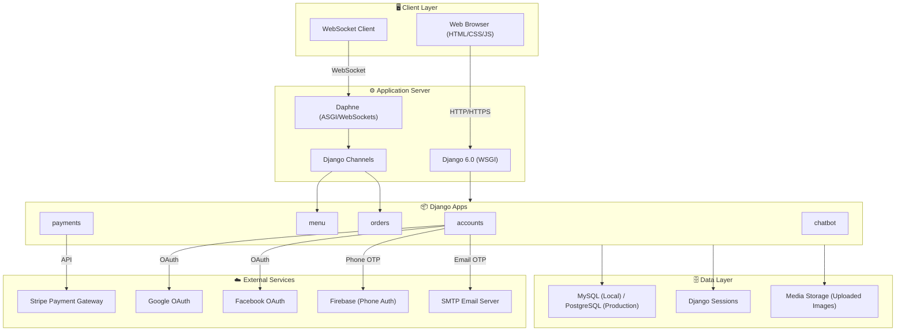
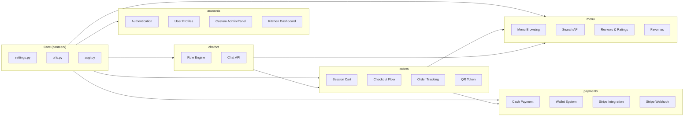
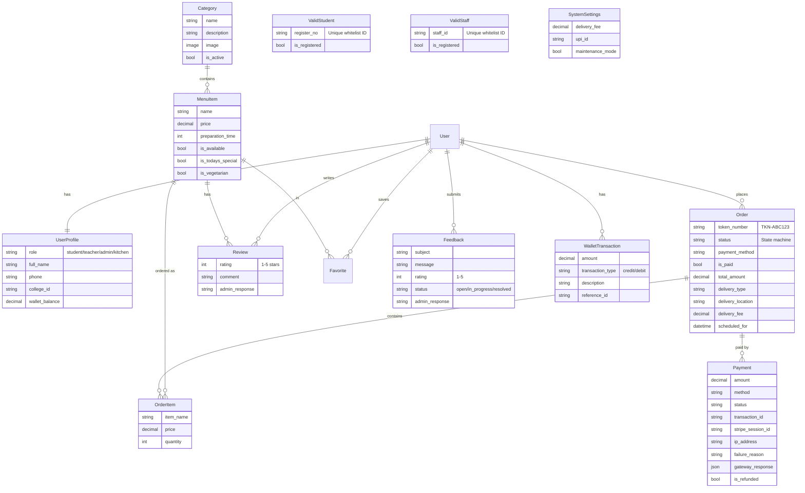
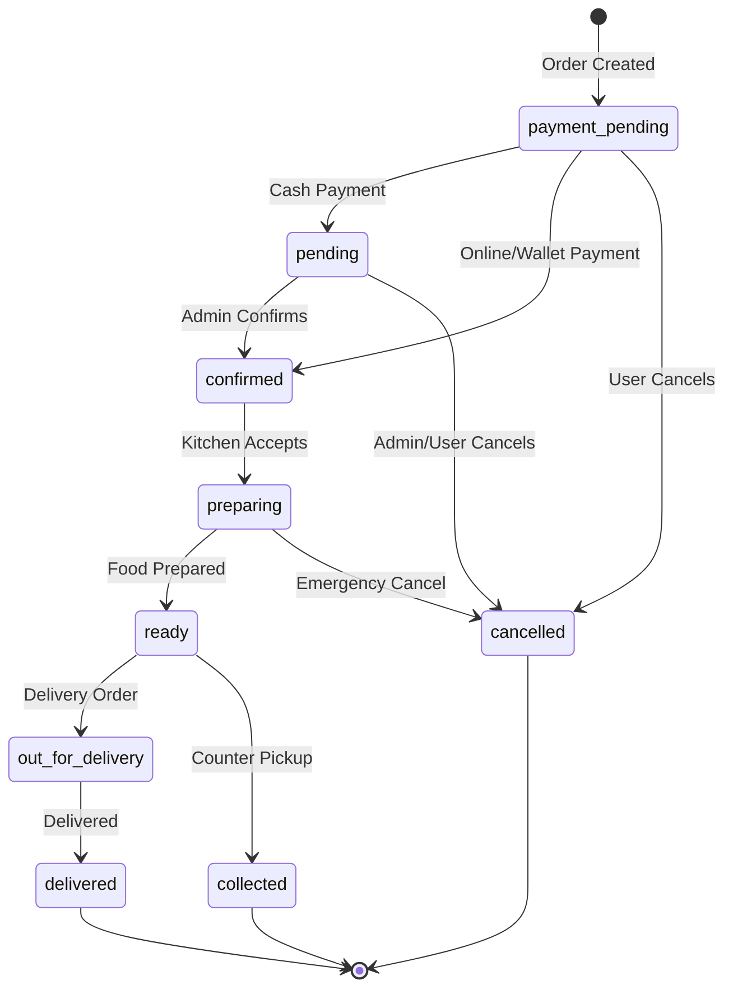
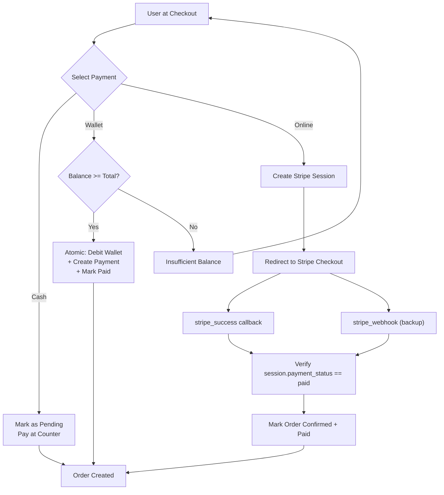
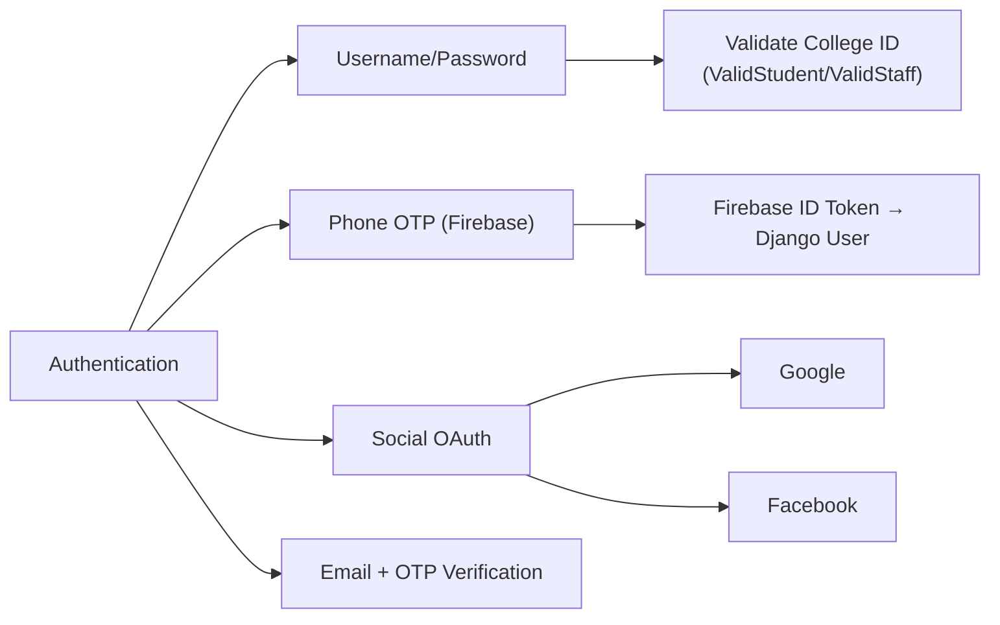
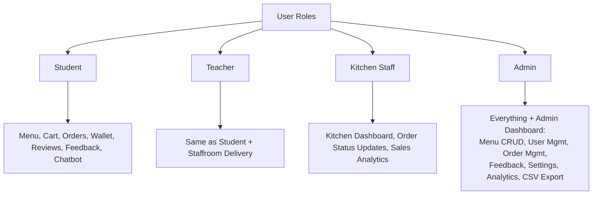
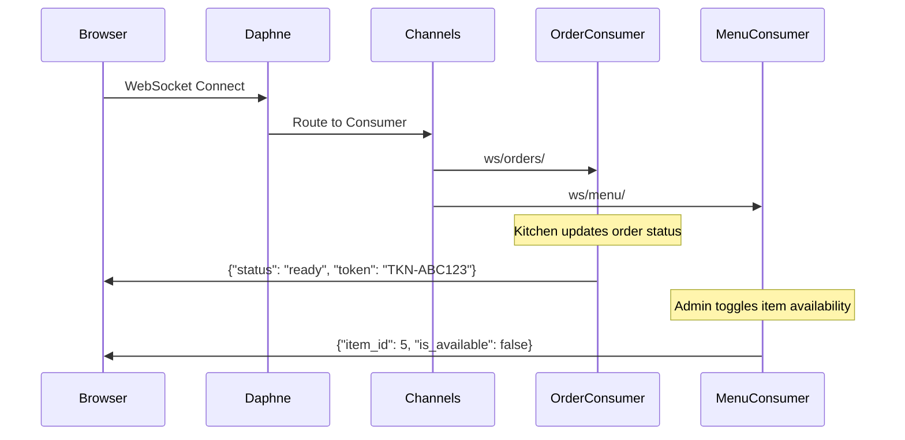
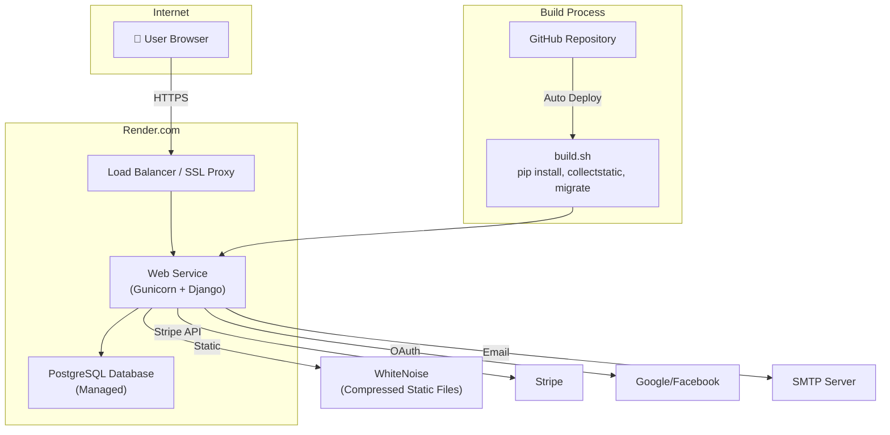

# 🏗️ CampusBites — System Design Document

> **Project:** CampusBites – Smart College Canteen Management System  
> **Version:** 1.0  
> **Date:** March 2026  
> **Technology:** Django 6.0 (Python), MySQL / PostgreSQL, Stripe, WebSockets  
> **Live URL:** https://campusbites-yps6.onrender.com

---

## 1. Introduction

### 1.1 Purpose
CampusBites is a full-stack web application that digitizes and automates the food ordering process in a college canteen. It replaces manual counter queues with an online ordering platform that supports real-time order tracking, multiple payment methods, and role-based dashboards.

### 1.2 Scope
The system covers:
- **Student/Teacher** — Browse menu, place orders, track status, pay online/wallet/cash, review food items
- **Kitchen Staff** — View incoming orders, update preparation status, sales analytics
- **Admin** — Manage menu, users, orders, feedback, system settings, and view analytics
- **Chatbot** — AI-powered rule-based assistant for quick queries

### 1.3 Key Features
| Feature | Description |
|---|---|
| 🍔 Digital Menu | Category-based menu with search, filters, veg/non-veg tags, today's specials |
| 🛒 Cart & Checkout | Session-based cart with delivery options (counter, classroom, staffroom) |
| 💳 Multi-Payment | Cash, UPI, Wallet, Stripe (online card payments) |
| 📦 Order Tracking | Real-time status via WebSockets + QR code tokens |
| 👨‍🍳 Kitchen Dashboard | Live order queue with sales analytics |
| 📊 Admin Dashboard | Revenue charts, user management, order export (CSV) |
| 🤖 Chatbot | Rule-based assistant for menu, orders, and canteen info |
| 🔐 Security | OTP login, OAuth (Google/Facebook), rate-limiting, CSRF, session hardening |
| 💰 Digital Wallet | In-app wallet with top-up and transaction history |
| ⭐ Reviews & Favorites | Per-item ratings, comments, and favorites list |

---

## 2. System Architecture

### 2.1 High-Level Architecture Diagram

### 2.2 Architecture Pattern
- **Pattern:** Monolithic MVC (MTV in Django terminology)
- **Frontend:** Server-rendered templates (Django Templates) + AJAX for dynamic features
- **Backend:** Django 6.0 with function-based views
- **Real-time:** Django Channels + Daphne (ASGI) for WebSocket communication
- **Deployment:** Render.com with Gunicorn (HTTP) + WhiteNoise (static files)

### 2.3 Technology Stack

| Layer | Technology |
|---|---|
| Language | Python 3.12 |
| Framework | Django 6.0 |
| ASGI Server | Daphne 4.2 |
| WSGI Server | Gunicorn 23.0 |
| Database (Dev) | MySQL 8.x |
| Database (Prod) | PostgreSQL (via `dj-database-url`) |
| Static Files | WhiteNoise |
| Payments | Stripe Checkout API |
| OAuth | django-allauth (Google, Facebook) |
| Phone Auth | Firebase Authentication (Pyrebase) |
| Real-time | Django Channels (InMemoryChannelLayer) |
| Rate Limiting | django-axes |
| Admin UI | django-jazzmin |
| QR Codes | python-qrcode |
| Deployment | Render.com |

---

## 3. Module Design

### 3.1 Module Overview

### 3.2 Module Details

#### 📁 `accounts` — Authentication & User Management
| Component | Description |
|---|---|
| `views.py` | Registration (with college ID validation), login (username/email), phone OTP login, email OTP verification, password reset (OTP-based), profile management, account deactivation |
| `admin_views.py` | Custom admin dashboard: overview stats, order management, menu CRUD, user management, feedback handling, system settings, analytics charts (JSON API), CSV export |
| `models.py` | `UserProfile` (roles: student/teacher/admin/kitchen, wallet), `ValidStudent`/`ValidStaff` (whitelist), `SystemSettings` (singleton config), `Feedback` (with status workflow) |
| `email_otp.py` | Email OTP generation and verification |
| `phone_auth.py` | Firebase phone authentication integration |
| `adapters.py` | Custom social account adapter for Google/Facebook OAuth |

#### 📁 `menu` — Menu & Food Item Management
| Component | Description |
|---|---|
| `views.py` | Menu listing (category filter, search, veg filter, pagination), item detail, review CRUD, favorites toggle, real-time availability API, fuzzy search API |
| `models.py` | `Category`, `MenuItem` (with availability, veg tag, specials, prep time), `Review` (1-5 star + comment), `Favorite` |
| `consumers.py` | WebSocket consumer for live menu availability updates |
| `services.py` | Business logic services for menu operations |

#### 📁 `orders` — Cart & Order Processing
| Component | Description |
|---|---|
| `views.py` | Session-based cart (add/remove/update/clear), checkout (delivery type selection), order placement, order history with pagination, order detail with QR code, cancel with wallet refund, reorder |
| `models.py` | `Order` (state machine with valid transitions), `OrderItem` |
| `consumers.py` | WebSocket consumer for real-time order status updates |
| `signals.py` | Post-save signal for order status change notifications |
| `utils.py` | Utility functions for order processing |

#### 📁 `payments` — Payment Processing
| Component | Description |
|---|---|
| `views.py` | Payment page (method selection), cash payment, wallet payment (atomic transactions), Stripe Checkout session creation, Stripe success callback, Stripe webhook handler, wallet top-up, payment status API |
| `models.py` | `Payment` (with audit fields, refund tracking), `WalletTransaction` (credit/debit ledger) |

#### 📁 `chatbot` — AI Assistant
| Component | Description |
|---|---|
| `views.py` | Chat API endpoint (POST JSON → response + quick replies) |
| `rules.py` | Comprehensive rule engine (~36KB) with intent matching for menu queries, order status, wallet info, canteen hours, specials, and more |

---

## 4. Data Model Design

### 4.1 Entity Relationship Diagram

### 4.2 Database Indexes
| Model | Index | Purpose |
|---|---|---|
| `MenuItem` | `is_available` | Fast filter for available items |
| `MenuItem` | `category + is_available` | Category-based menu queries |
| `MenuItem` | `is_todays_special` | Today's specials listing |
| `Order` | `status` | Dashboard order filtering |
| `Order` | `created_at` | Chronological ordering |
| `Order` | `user + status` | User's order history |
| `Order` | `status + created_at` | Admin order analytics |

---

## 5. Order State Machine

| From | Allowed Transitions |
|---|---|
| `payment_pending` | `pending`, `confirmed`, `cancelled` |
| `pending` | `confirmed`, `cancelled` |
| `confirmed` | `preparing`, `cancelled` |
| `preparing` | `ready`, `cancelled` |
| `ready` | `out_for_delivery`, `collected` |
| `out_for_delivery` | `delivered` |
| `delivered` | — (terminal) |
| `collected` | — (terminal) |
| `cancelled` | — (terminal) |

---

## 6. Payment Flow

### 6.1 Payment Methods

### 6.2 Wallet System
- **Max Balance:** ₹10,000
- **Max Single Top-up:** ₹5,000
- **Min Top-up:** ₹10
- **Ledger:** Every transaction recorded in `WalletTransaction` (credit/debit with description)
- **Refund:** Automatic wallet credit on order cancellation (atomic transaction)

---

## 7. Authentication & Security

### 7.1 Authentication Methods

### 7.2 Security Features

| Feature | Implementation |
|---|---|
| **Rate Limiting** | django-axes: 5 failed attempts → 1 hour lockout |
| **CSRF Protection** | Django CSRF middleware + trusted origins |
| **Session Hardening** | HttpOnly cookies, SameSite=Lax, 24hr expiry, extend on activity |
| **Password Validation** | Min 8 chars, not common, not numeric-only, not similar to user info |
| **SSL/TLS** | Enforced in production (Render proxy handles SSL) |
| **XSS Protection** | Secure browser headers (X-Frame-Options: DENY, X-Content-Type-Options) |
| **College ID Whitelist** | Only pre-approved register numbers can sign up |
| **OTP Password Reset** | 6-digit OTP via email with cooldown protection |

### 7.3 Role-Based Access

---

## 8. API Endpoints

### 8.1 Public / Auth Pages
| Method | Endpoint | Description |
|---|---|---|
| GET/POST | `/register/` | User registration with college ID |
| GET/POST | `/login/` | Username/email login |
| GET | `/logout/` | User logout |
| GET/POST | `/phone-login/` | Phone OTP login page |
| POST | `/phone-verify/` | Verify Firebase token |
| GET/POST | `/forgot-password/` | Password reset (OTP) |

### 8.2 Menu
| Method | Endpoint | Description |
|---|---|---|
| GET | `/menu/` | Menu listing with filters |
| GET | `/menu/<id>/` | Item detail with reviews |
| POST | `/menu/<id>/review/` | Add/update review |
| POST | `/menu/<id>/favorite/` | Toggle favorite |
| GET | `/api/menu-availability/` | Realtime item availability (JSON) |
| GET | `/api/search/?q=` | Fuzzy search API (JSON) |

### 8.3 Cart & Orders
| Method | Endpoint | Description |
|---|---|---|
| GET | `/cart/` | View cart |
| POST | `/cart/add/<id>/` | Add item to cart |
| POST | `/cart/remove/<id>/` | Remove item |
| POST | `/cart/update/<id>/` | Update quantity |
| POST | `/cart/clear/` | Clear all items |
| GET | `/checkout/` | Checkout page |
| POST | `/place-order/` | Create order |
| GET | `/orders/` | Order history |
| GET | `/order/<id>/` | Order detail + QR code |
| POST | `/order/<id>/cancel/` | Cancel order |
| POST | `/order/<id>/reorder/` | Re-add to cart |

### 8.4 Payments
| Method | Endpoint | Description |
|---|---|---|
| GET | `/payment/<order_id>/` | Payment method selection |
| POST | `/payment/<order_id>/cash/` | Process cash payment |
| POST | `/payment/<order_id>/wallet/` | Process wallet payment |
| POST | `/payment/<order_id>/online/` | Create Stripe session |
| GET | `/payment/<order_id>/stripe/success/` | Stripe success callback |
| POST | `/stripe/webhook/` | Stripe webhook (backup) |
| GET | `/wallet/` | Wallet dashboard |
| POST | `/wallet/add/` | Top-up wallet |
| GET | `/api/payment/<id>/status/` | Payment status poll (JSON) |

### 8.5 Admin Dashboard (JSON APIs)
| Method | Endpoint | Description |
|---|---|---|
| GET | `/admin-dashboard/` | Admin overview |
| GET | `/admin-dashboard/api/stats/` | Dashboard stats (AJAX) |
| GET | `/admin-dashboard/api/chart-data/` | Revenue/order charts |
| GET | `/admin-dashboard/api/orders/` | Orders table (AJAX) |
| POST | `/admin-dashboard/api/users/` | User role/status management |
| GET | `/admin-dashboard/orders/export/` | CSV export |

### 8.6 Chatbot
| Method | Endpoint | Description |
|---|---|---|
| POST | `/chatbot/chat/` | Send message → get response + quick replies |

---

## 9. Real-Time Communication

### 9.1 WebSocket Architecture

### 9.2 WebSocket Endpoints
| Path | Consumer | Purpose |
|---|---|---|
| `ws/orders/` | `OrderConsumer` | Real-time order status updates |
| `ws/menu/` | `MenuConsumer` | Live menu availability changes |

- **Channel Layer:** InMemoryChannelLayer (suitable for single-server deployment)

---

## 10. Deployment Architecture

### 10.1 Environment Variables
| Variable | Purpose |
|---|---|
| `SECRET_KEY` | Django secret key |
| `DEBUG` | Debug mode (False in production) |
| `DATABASE_URL` | PostgreSQL connection string |
| `STRIPE_PUBLISHABLE_KEY` | Stripe frontend key |
| `STRIPE_SECRET_KEY` | Stripe backend key |
| `STRIPE_WEBHOOK_SECRET` | Stripe webhook signature |
| `EMAIL_HOST` / `EMAIL_HOST_USER` / `EMAIL_HOST_PASSWORD` | SMTP credentials |
| `FIREBASE_API_KEY` / `FIREBASE_AUTH_DOMAIN` | Firebase phone auth config |

---

## 11. Non-Functional Requirements

| Requirement | Implementation |
|---|---|
| **Performance** | DB indexes on hot columns, WhiteNoise compressed static, session-based cart (no DB writes for cart) |
| **Scalability** | Stateless app server (can scale horizontally on Render), PostgreSQL handles concurrent connections |
| **Reliability** | Stripe webhook as backup for payment confirmation, atomic transactions for wallet operations |
| **Security** | OWASP best practices: CSRF, XSS, clickjacking, rate-limiting, session hardening |
| **Availability** | Render.com auto-restart on failure, health checks |
| **Maintainability** | Modular Django apps, state-machine pattern for orders/feedback, singleton for settings |

---

## 12. Future Enhancements

| Enhancement | Description |
|---|---|
| 🔔 Push Notifications | FCM/Web Push for order-ready alerts |
| 📱 Mobile App | React Native or Flutter frontend |
| 🤖 AI Chatbot | Replace rule engine with LLM (GPT/Gemini) |
| 📈 ML Recommendations | Personalized menu suggestions based on order history |
| 🏪 Multi-Canteen | Support multiple canteens on one campus |
| ⏰ Pre-Order Scheduling | Enhanced scheduled ordering with time-slot management |
| 🔄 Redis Channel Layer | Replace InMemoryChannelLayer for multi-server WebSockets |
| 📊 Advanced Analytics | Heatmaps, demand forecasting, waste reduction metrics |

---

*Document generated from codebase analysis — CampusBites v1.0*
